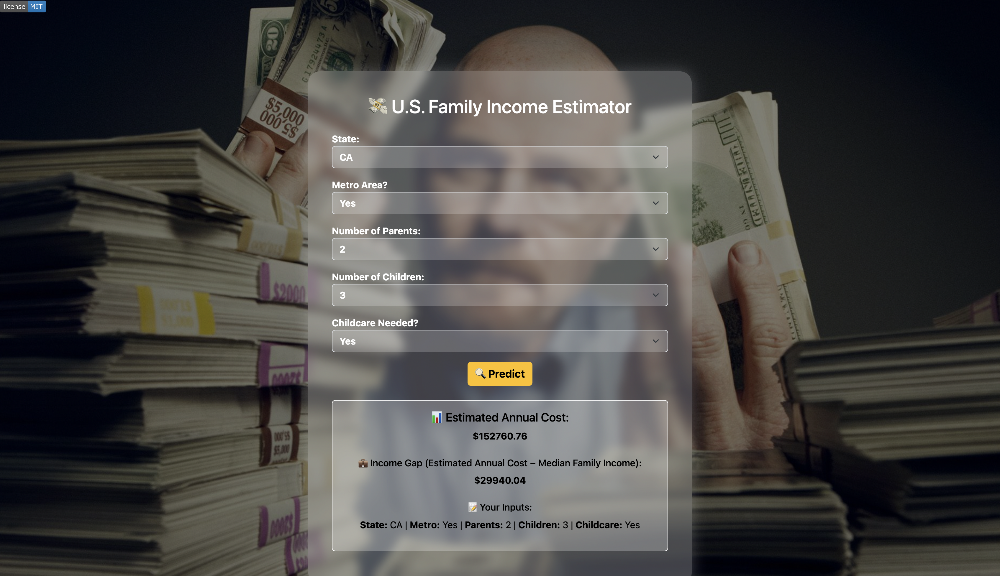

# Cost estimator
# 🏠 Cost of Living Estimator Web App

This web application helps estimate the **annual cost of living** based on inputs like state, metro area, number of parents, children, and whether childcare is needed. Users can compare estimated costs with the median family income to see how affordable life is in a given scenario.

---

## 📊 Model Details

- **Algorithm Used**: Linear Regression  
- **Training Data**: Over 30,000 cleaned and preprocessed records  
- **Evaluation Metrics**:
  - Mean Squared Error (MSE)
  - R-squared Score: **0.99** (very high accuracy)

The model was trained to predict the total annual cost given specific family and location conditions. It uses encoded state information and matches combinations of inputs for fast, reliable predictions.

---

## 🌐 Tech Stack

- **Frontend**: HTML, CSS (no static folder used)
- **Backend**: Flask (Python)
- **Model Handling**: `joblib` for loading the state encoder  
- **Data**: CSV dataset for cost lookup, trained locally

---

## 📷 Screenshot




---

## 🚀 How to Run Locally

1. Clone the repo  
2. Make sure `state_encoder.pkl` and `cost_lookup.csv` are in the root folder  
3. Run the Flask app:
   ```bash
   python app.py

## License

This project is licensed under the [MIT License](LICENSE).
